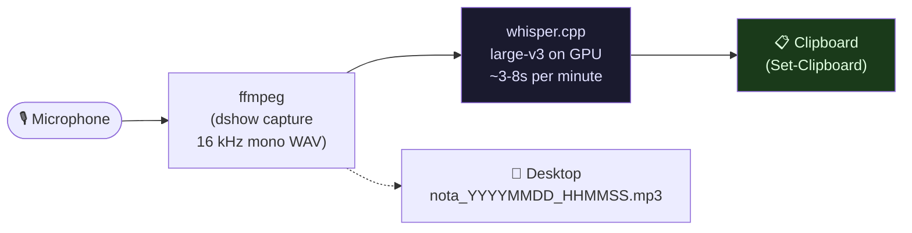
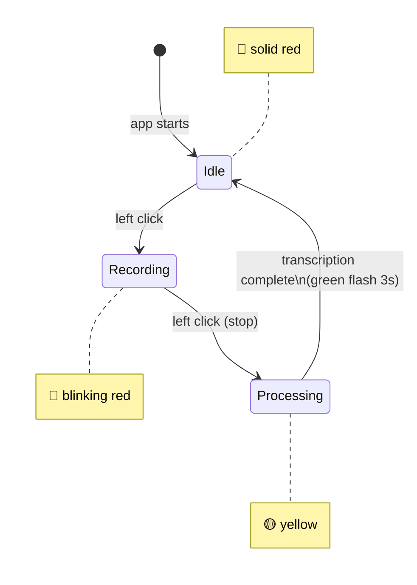

# Local Voice Recorder → Clipboard

> **Speak freely. Think out loud. Get clean text in your clipboard — 100% local, zero cloud.**

A Windows system-tray app that records your voice, transcribes it on your GPU with [whisper.cpp](https://github.com/ggerganov/whisper.cpp), and puts the text straight into your clipboard. One click to start, one click to stop.

[](LICENSE)
[]()
[]()
[]()

---

## Why I built this

Most LLMs and AI assistants don't accept voice input, or their transcription quality is mediocre at best. I wanted to:

- **Speak to any AI** (Claude, ChatGPT, local LLMs) — paste the transcription, done.
- **Develop ideas at speaking speed**, not typing speed. Thinking out loud is 3× faster than typing.
- **Keep everything private.** Voice carries emotion, tone, and context that you may not want on anyone's servers. Whisper runs entirely on your local GPU — no audio leaves your machine.
- **Work across all apps** — clipboard is the universal interface. Works in any browser, IDE, chat window, email client.

```
Click → Speak → Click → Ctrl+V
```

---

## How it works



### State machine (tray icon color)



---

## Features

| Feature | Detail |
|---|---|
| **One-click record/stop** | Left-click the tray icon |
| **Local GPU transcription** | whisper.cpp large-v3 on CUDA — ~3-8s/min of audio |
| **Auto clipboard** | `Set-Clipboard` on completion — Ctrl+V anywhere |
| **Desktop audio archive** | MP3 saved with timestamp (voice memo backup) |
| **Color-coded states** | 🔴 idle · 🔴 blinking = recording · 🟡 processing · 🟢 done |
| **Single instance** | Mutex prevents two recorders fighting over the mic |
| **Silent autostart** | VBS launcher → no console window on login |
| **No installation of Python/Torch** | whisper.cpp is a native binary; ffmpeg is the only other dep |

---

## Requirements

- **Windows 10/11**
- **NVIDIA GPU** (CUDA 12)
- **[whisper.cpp](https://github.com/ggerganov/whisper.cpp)** compiled with CUDA — place the build in `D:\whisper\bin\Release\`
- **whisper model** `ggml-large-v3.bin` in `D:\whisper\models\` (download from [Hugging Face](https://huggingface.co/ggerganov/whisper.cpp))
- **[ffmpeg](https://ffmpeg.org/)** — `winget install Gyan.FFmpeg` or from PATH

---

## Setup

### 1. Build whisper.cpp with CUDA

```powershell
git clone https://github.com/ggerganov/whisper.cpp
cd whisper.cpp
cmake -B build -DGGML_CUDA=ON
cmake --build build --config Release
# copy build/bin/Release/whisper-cli.exe to D:\whisper\bin\Release\
```

### 2. Download the model

```powershell
# large-v3 (~3 GB, best accuracy)
Invoke-WebRequest -Uri "https://huggingface.co/ggerganov/whisper.cpp/resolve/main/ggml-large-v3.bin" `
    -OutFile "D:\whisper\models\ggml-large-v3.bin"
```

### 3. Install the recorder

```powershell
git clone https://github.com/msemino/local-voice-recorder
cd local-voice-recorder
powershell -ExecutionPolicy Bypass -File src\install.ps1
```

This creates:
- A **Desktop shortcut** → double-click to launch
- An **autostart shortcut** → launches silently on login

---

## Usage

1. Look for the **red dot** in your system tray (may be under the `^` arrow).
2. **Left-click** → recording starts (icon blinks red).
3. Speak. No time limit.
4. **Left-click again** → stops recording, GPU transcribes, text lands in clipboard.
5. **Ctrl+V** anywhere.

```
🔴 (ready)  →  🔴💓 (recording)  →  🟡 (transcribing)  →  🟢 (done → Ctrl+V)  →  🔴
```

**Right-click** the icon for the context menu: Record/Stop, Exit.

---

## Engineering notes

### Why not use the Windows Speech API?
Windows STT is decent for commands but struggles with technical vocabulary, code, or spontaneous speech in Spanish (or multilingual input). Whisper large-v3 handles all of that accurately, including mixed-language output.

### Why ffmpeg with the "Alternative name"?
`dshow` (Windows audio capture) exposes two names per device: the display name (may contain Unicode, e.g. `Micrófono (HyperX SoloCast)`) and the "Alternative name" (always ASCII, e.g. `@device_cm_{...}\wave_{...}`). PowerShell passes arguments to processes as ANSI strings — the display name's accented characters can corrupt the argument, silently failing to open the mic. Using the Alternative name avoids the encoding trap entirely.

```powershell
# how the script finds the safe device name
ffmpeg -list_devices true -f dshow -i dummy 2>&1 |
    Select-String "Alternative name" |
    ForEach-Object { ($_ -split '"')[1] }
```

### Stopping ffmpeg gracefully
Killing ffmpeg with `Kill()` truncates the output file (no proper trailer). Instead, the script **sends `q` via stdin** — ffmpeg's standard quit signal — then waits up to 8 seconds for a clean exit. The result is a properly finalized WAV/MP3.

### PowerShell 5.1 + ASCII constraint
PowerShell 5.1 reads `.ps1` files without BOM as ANSI. Accented characters in **string literals in the source code** (not runtime output) cause parse errors. The script is kept **ASCII-only in its source**; whisper outputs are read at runtime with `-Encoding UTF8`, so accents in the transcription come out correctly.

---

## Troubleshooting

| Symptom | Cause | Fix |
|---|---|---|
| Icon hidden | Windows moves new tray icons behind `^` | Drag it to the visible area |
| Empty transcription | Mic not captured | Check `grabador.log`; device name printed on startup |
| App won't start | Already running | Only one instance allowed (mutex) — check Task Manager |
| Slow transcription | GPU clock in ECO mode | Switch to Performance or run `nvidia-smi -pm 1` |
| PS parse error on launch | Non-ASCII char in script | Ensure you saved as ASCII (not UTF-8 BOM) |

---

## Related projects

- **[whatsapp-voice-transcriber](https://github.com/msemino/whatsapp-voice-transcriber)** — same whisper.cpp stack, but transcribes incoming WhatsApp voice notes automatically and sends the text back to you.
- **[self-hosted-ai-lab](https://github.com/msemino/self-hosted-ai-lab)** — the 2-node system this recorder is part of (NUC 24/7 + 24 GB GPU PC).
- **[local-agent-orchestrator](https://github.com/msemino/local-agent-orchestrator)** — Hermes AI orchestrator that consumes these transcriptions as input.

---

## License

MIT © Marcelo Semino
